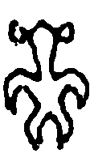
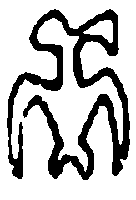
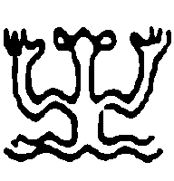
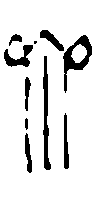

# ga-decipher

A simple implementation of a genetic algorithm to solve substitution ciphers, aimed at the decipherment of unknown scripts. The model uses a simple n-gram model to score candidate mappings and a genetic algorithm to search for the best solution. The program was devised to solve the Rongorongo script of Easter Island, but in theory can be used for any other unknown script.

## Installation

1. Install dependencies
```
pip install -r requirements.txt
```
2. Run the program
```
python main.py <source_file> <target_file> [options]
```

## Usage

To run the program, execute the main.py script with the following command-line arguments:

* `source_file`: Path to the file containing the source text.
* `target_file`: Path to the file containing the target text.

Where the source is the cipher text (i.e. texts written in an unknown script) and the target is the plain text - a corpus presumably in the same language as the source, but transliterated. They can be independent, as long as representing the same language.

Additional options:

* `-ng, --n-gram`: N-gram size (default: 3)
* `-s, --num-symbols`: Number of symbols (default: 50)
* `-i, --ignore`: Symbols to ignore during decoding (comma-separated)
* `-n, --pop-size`: Population size (default: 1000)
* `-p, --num-parents`: Number of parents (default: 500)
* `-m, --mutation-rate`: Mutation rate (default: 0.5)
* `-c, --crossover-rate`: Crossover rate (default: 0.8)
* `-g, --generations`: Number of generations (default: 1000)
* `-nc, --n-cores`: Number of CPU cores to use (default: 0, uses all available cores)
* `-e, --eval`: Evaluation file to assess accuracy
* `-o, --output`: Output folder to save results

The source and target texts are expected to be simple text files with newline separated sentences. If an evaluation file is provided, it is expected to be a text file with pairs of source and target symbols separated by a space. Refer to the sample files in the `data` folder as examples.

## Example

For running the Japanese experiment with the hiragana text as source, evaluating the results on the correct mapping file and writing the results to a `japanese_results` folder:

```
python main.py data/hiragana.txt data/japanese.txt -e data/japanese_mapping.txt -o japanese_results
```

## Experiment

The model was tested on a corpus of Japanese sentences obtained from <a href="https://tatoeba.org">tatoeba</a>. The choice of Japanese is due to its logosyllabic writing system and relatively simple syllable structure, which make it an appropriate modern parallel for Rongorongo and Rapanui.

Two versions of the Japanese corpus were used - an artifically generated one where only hiragana was used, and the original one with mixed kanji, hiragana and katakana. The former allows for assessing performance for a purely syllabic writing system, while the latter more realistically represents a noisy scenario where logograms are mixed with syllables. A sample of 1000 sentences were used for fitting the language model, and another 1000 for decipherment.

The model correctly identifies 40-50% of the (syllabic) symbols in both corpora. Of the top 10 symbols, 8-10 are correctly identified (if one counts the reading of は as *wa*), showing that it performs well even in a noisy scenario.

## Results

The Rapanui language model was fitted on a sample of short recitations and songs assumed to represent the genres and language present in Rongorongo (Barthel 1960; Blixen 1979; Campbell 1971). For the written corpus, the set of texts removing parallel passages and repetitive structured sequences usually called the "independent text" (Horley 2007) was used. The original Barthel encoding was converted to the simplified proposal by Horley (2021). For details, the reader is referred to the discussion and code in <a href="https://github.com/jgregoriods/rongopy">my other rongorongo repository</a>.

A second corpus was prepared by removing the anthropomorphs 200, 381 and 256, as well as glyph 3, under the assumption the former are allographs and are frequently omitted, and that the latter appears to be a decorator (see the discussion <a href="https://github.com/jgregoriods/rongopy/tree/master/ga_lstm">here</a>). The results are presented in the table below.


| Glyph | Code | Syllable<sub>1</sub> | Syllable<sub>2</sub> |
| --- | --- | --- | --- |
|  | 200 | a | |
|  | 6 | i | a |
|  | 10 | u | ta |
|  | 1 | e | i |
|  | 600 | ta | e |
|  | 4 | ma | u |
|  | 2 | ra | ka |
|  | 3 | te | |
|  | 381 | ka | |
|  | 256 | re | |
|  | 8 | tu | o |
|  | 430 | ri | ha |
|  | 9 | ha | ra |
|  | 5 | o | te |

It is curious that the readings of 600 as *ta* and 381 as *ka* have previously been suggested based on independent evidence (Guy 1990; Davletshin 2022).

This is by no means an endorsement that the above solution is correct, as it heavily depends on the correct identification of the glyph inventory, the nature of rongorongo as mainly syllabic, the assumption that the chosen rapanui corpus is representative of the language in the glyphs, among other factors.